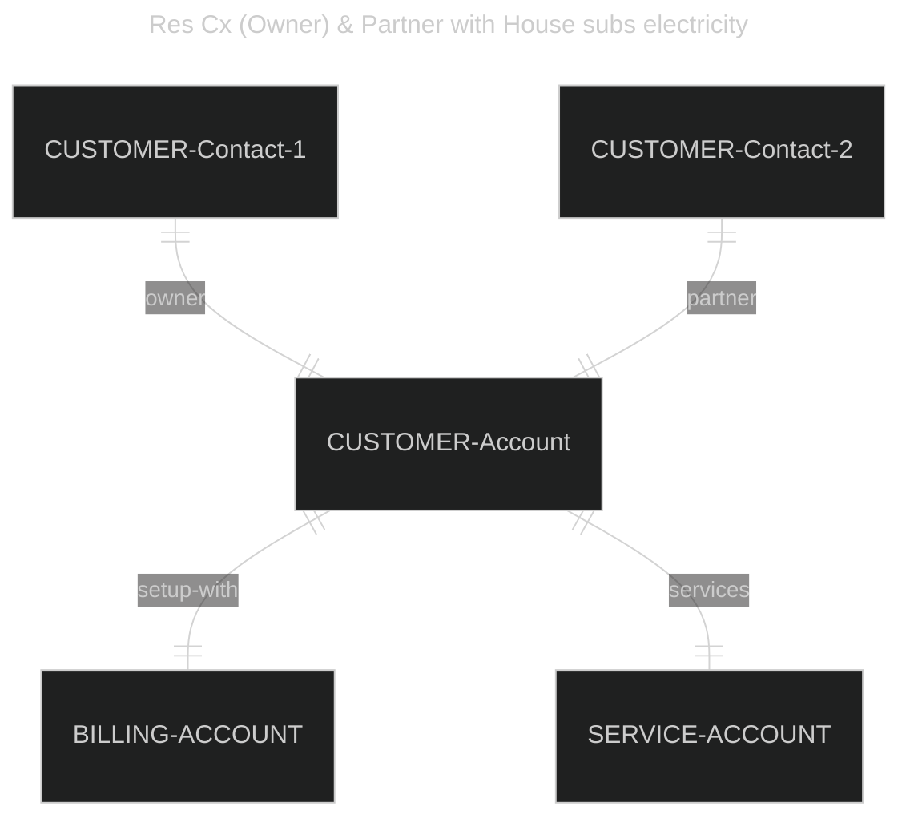
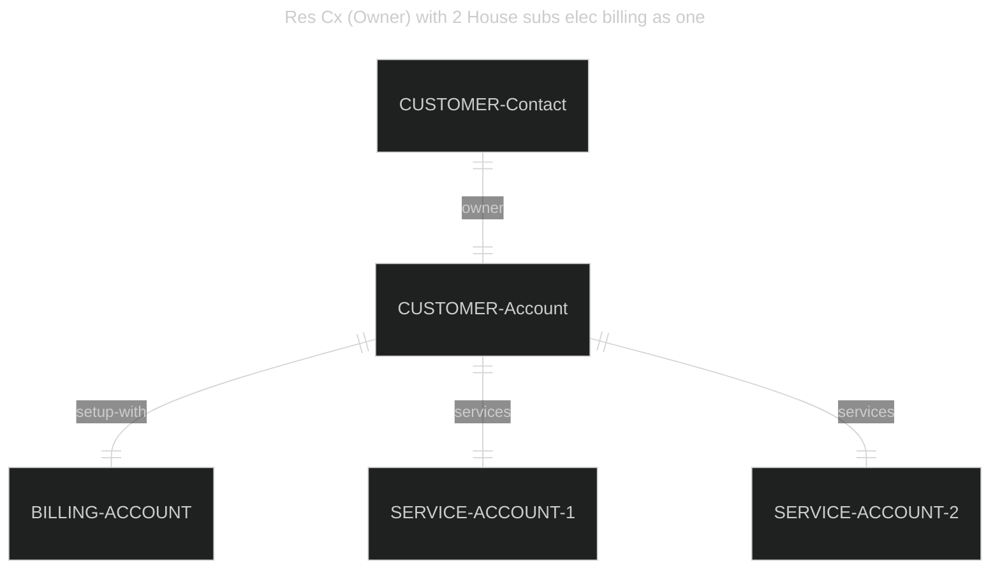
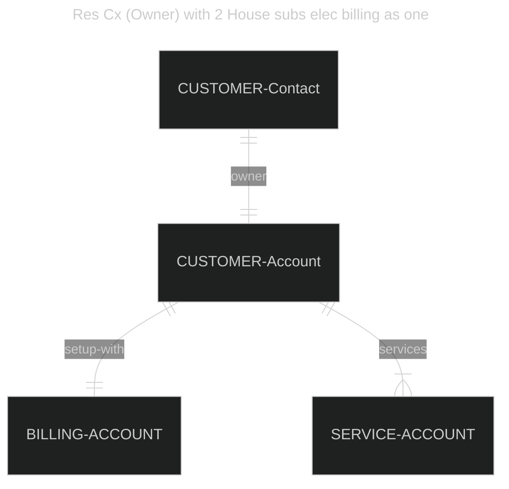

# Introduction
Salesforce Industries introduces a new set of data models. These models are
often not understood clearly in its purpose. Further given the focus on
flexibility and extensibility on the platform, the developer/architect has
flexibility in interpreting the use case for these models in their own
businesses.  

This reminds us of the early days of salesforce where the ease of building and
interpretations of objects led to architectures that were not maintainable. This
led to an impact to the business over the longer term and also affected the
perceptions of the Salesforce ecosystem as a whole.  

It is important to understand how the models were designed, and why and see a
few examples of how the flexibility of these models can be utilised for various
use cases.

# Model at a High Level

The model uses Salesforce core objects as is, extends on  salesforce objects and
in other cases introduces objects to setup the model.

# Highlights
- Imagine the model across a Customer and Infrastructure paradigm
    - Customer linked and Customer specific information
    - Location linked and Customer independent information
- EnU uses Account hierarchy for its Customer linked modelling
    - Customer Account is in the **Account** Object  
    - Service Account is in the **Account** Object
    - Billing Account is in the **Account** Object  
    NTE: articulate the billing vs the service account
    This structure primarily supports situations where a local point is the
service point, while the billing maybe another entity completely.  
    Can be imagined as a service account at a plant, vs billing to a specific
business unit of the company.  
    Practically would see the specific roles linked the each account that gives
more clarity on its utility. Plant manager associated to the service account
would be different to the infrastructure manager at the company's business unit
level, responsible for multiple plants.  
    
    - why: this affords a common model to support different structures
        - B2B, B2C, B2B2B & a combination with common actors  
    NTE: recheck whether it uses the account hierarchy or other lookups.

- On the location side of the equation, the location is described in the
  premise object
    - Premise hold location information; this is independent of the customer
    - Premise can have a hierarchy information
    - the utility infrastructure is associated usually with the premise unit

- On the utility infrastructure side, there is a service points and meter for
  the service point  
    - Service point refers to the point at which a utility is connected or
      linked
    - there is a metering devise associated with the service point
    - primary reason for these to be separated out is to manage the history of
      changes etc against a given service point
    - a service point therefore would be for a single type of utility; read
      with a specific meter for the same
    - large locations could have multiple service points and meters

# Examples of the model

## Res Cx (Owner) with House subs electricity

## Res Cx (Owner & Partner) with House subs electricity
_simple representation_

_proper representation_

## Res Cx (Owner) withi 2 House subs electricity
_simple representation_

_proper representation_

[Reference Salesforce Help
Documentation](https://help.salesforce.com/s/articleView?id=ind.v_data_models_energyutilities_cloud_data_model_667337.htm&type=5)

